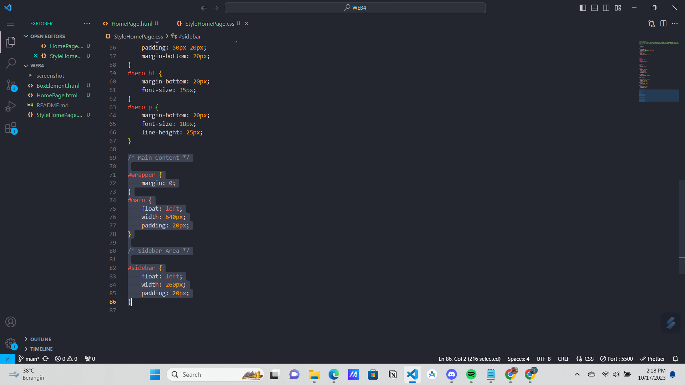

# Tugas Praktikum { Pertemuan ke 5 } 

|**Nama**|**NIM**|**Kelas**|**Matkul**|
|----|---|-----|------|
|Muhammad Ikhsan Fakhrudin|312210019|TI.22.A.2|Pemrograman WEB|

# HTML dan CSS Lanjutan

## Langkah-langkah Praktikum

Membuka ``text editor`` , di sini saya menggunakan ***Visual Studio Code.***

## Membuat Box Element + CSS Float Property

## Mengatur Clearfix Element

## Membuat Layout Sederhana

Tambahkan kode CSS untuk Membuat layoutnya.

## Membuat Navigasi

## Membuat Hero Panel

## Mengatur Layout Main dan Sidebar

Selanjutnya mengatur ``main content dan sidebar``, tambahkan CSS float.

## Membuat Sidebar Widget

## Mengatur Footer

Selanjutnya mengatur tampilan footer. Tambahkan CSS untuk footer.

## Menambahkan Elemen Lainnya Pada Main Content

Kemudian tambahkan style pada CSS.

***Output :***

## Menambahkan Content Artikel

Kemudian tambahkan style pada CSS.

***Output :***

## Pertanyaan dan Tugas

1. Tambahkan Layout untuk menu About => buat single layout yang berisi deskripsi, portfolio, dll.

2. Tambahkan layout untuk menu Contact => yang berisi form isian : nama, email, message, dll.

## Jawab

## 1. Membuat HTML dan CSS Seperti berikut :

***Output :***

## SELESAI  

